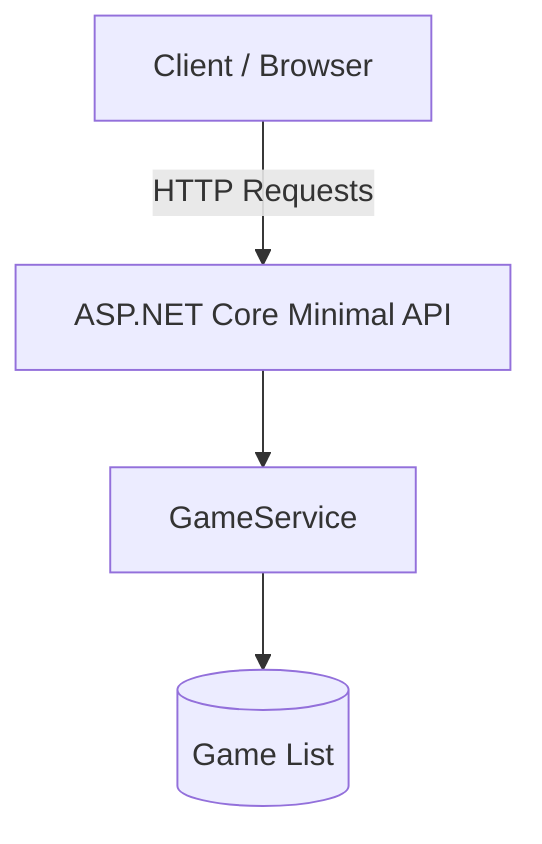

# GameStore

## Summary

GameStore is a training project focused on building an ASP .NET Core API.

## Project Details

### Technologies

    

### Resources

This project mainly rely on the following ressources:

* youtube tutorial by Julio Casal  [ASP.NET Core Full Course For Beginners (.NET 10)](https://www.youtube.com/watch?v=YbRe4iIVYJk&t=1724s)
* [Swagger Documentation](https://swagger.io/docs/)

### Project Structure

```bash
│   .gitignore
│   GameStore.slnx
│   README.md
│
├───GameStore.Api
│   │   appsettings.json
│   │   GameStore.Api.csproj
│   │   Program.cs
│   │
│   ├───Dtos
│   │       CreateGameDto.cs
│   │       GameDto.cs
│   │       UpdateGameDto.cs
│   │
│   ├───Properties
│   │       launchSettings.json
│   │
│   └───Services
│           GameService.cs
```

### Current State of the App

* A minimal API that allows:
  * retrieving a list of games (to simulate a DB connection)
  * retrieving a single game by ID
  * creating a new game
  * updating an existing game by ID
  * delete a game by ID
* Swagger implementation to document and test the API endpoints
* Basic DTOs for Game object, Game creation and Game update
* A GameService (for now just contains a method for auto-generation of next Id, without using free Ids following entry deletion)

### Next Steps...

* refactoring endpoints' handlers
* creating and linking API to an actual DB
* creating and linking to a frontend

## API Details

### API Flow



### API endpoints

| Method | Endpoint    | Request Body  | Response               |
| ------ | ----------- | ------------- | ---------------------- |
| GET    | /games      | -             | List of GameDto        |
| GET    | /games/{id} | -             | GameDto or 404         |
| POST   | /games      | CreateGameDto | Created GameDto        |
| PUT    | /games/{id} | UpdateGameDto | Updated GameDto or 404 |
| DELETE | /games/{id} | -             | 204 No Content or 404  |

## Getting Started

### Pre-requisites

Make sure you have the  SDK installed on your machine (or at least the framework to compile and execute).

Clone the repository

```bash
git clone https://github.com/jdelobel5987/GameStore.git
```

### Launch the API

```bash
cd GameStore/GameStore.Api

dotnet run
```

The API will launch and listen on `http://localhost:5156` by default (edition can be made within /Properties/launchSettings.json). The root endpoint displays a welcome message.

### API endpoints (Swagger UI)

To access the API documentation / test, open your browser at `http://localhost:5156/swagger`.


